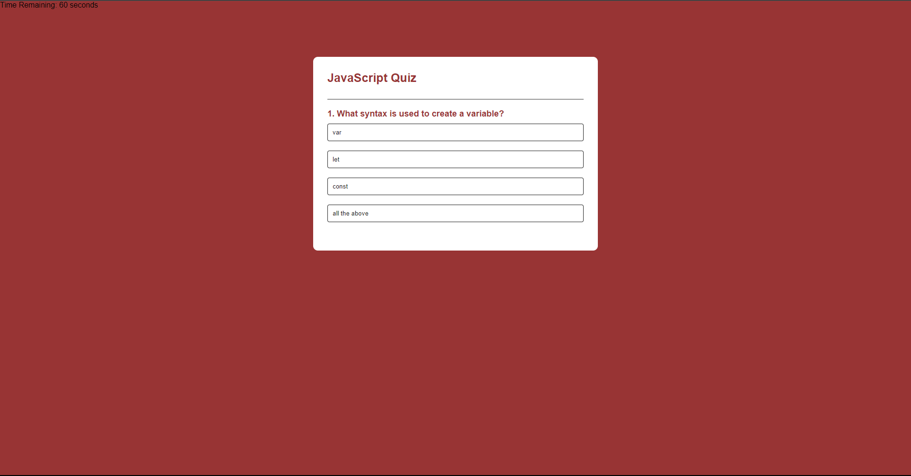

# javascript-quiz

## Description
Simple JavaScript application that quizes over JavaScript basics and keeps track of your name, score, and time.
Your score and name are saved locally and displayed on the score screen.
This application was created using HTML, CSS, and JavaScript.

## Visuals

## Installation

1. Link to webpage: 
OR  
2. Download the repository and open the `index.html` file in your browser.

## Usage
Launch in your browser and take the quiz. After the quiz is finished, you can either save score or try again. 
Saving your score will prompt you enter your name.
After your name and score is saved, the score screen will display local scores and associated names. 

## License
This project is licensed under MIT. 

